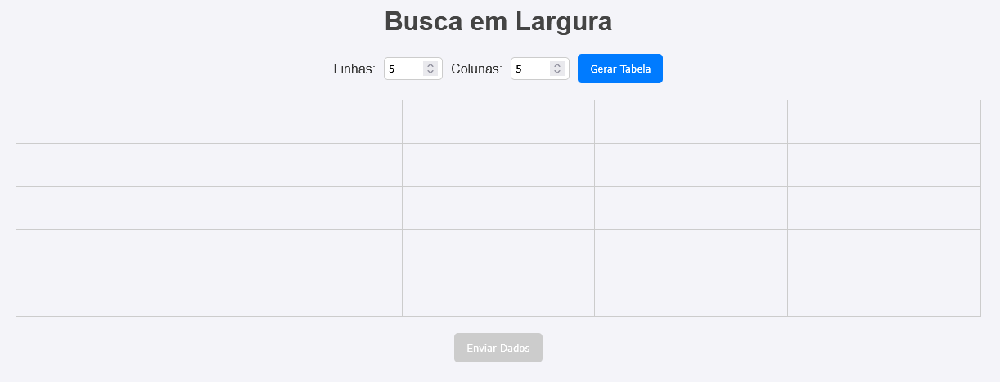
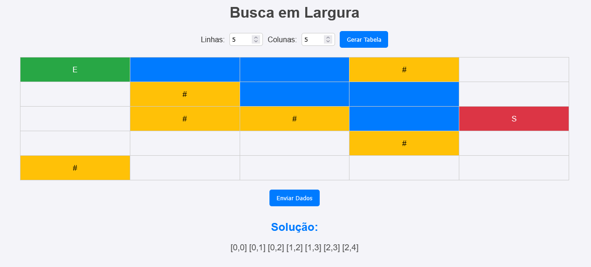
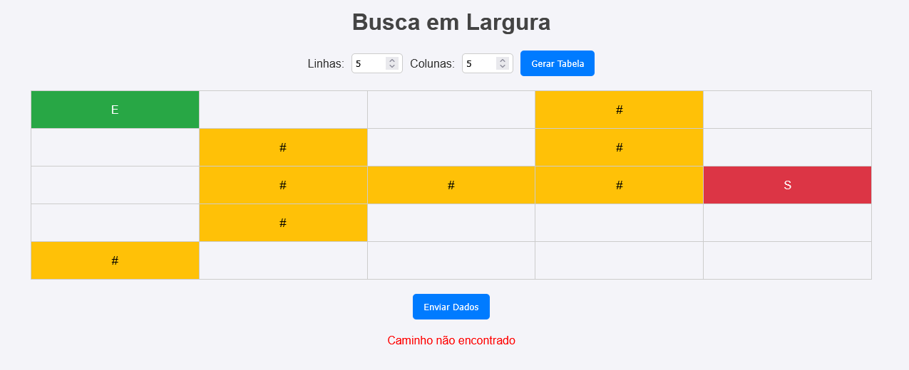

## Descrição

Esta aplicação é uma interface interativa para resolver
problemas de busca em profundidade (BFS). O usuário pode gerar uma
tabela dinâmica, configurar pontos de **entrada** (E), **saída** (S) e **obstáculos**
 (#), e enviar os dados para o servidor. O servidor processa esses dados
 utilizando um algoritmo BFS e retorna o caminho encontrado, que é
exibido na interface. Caso não seja possível encontrar um caminho, uma
mensagem de erro será exibida.

## Funcionalidades

1. **Geração de Tabela Dinâmica** :

* O usuário pode especificar o número de linhas e colunas da tabela.
* A tabela é gerada dinamicamente na interface.

1. **Configuração de Células** :

* As células podem ser configuradas como:
  * Vazio (`""`)
  * Entrada (`E`)
  * Saída (`S`)
  * Obstáculo (`#`)

1. **Validação Automática** :

* O botão "Enviar Dados" só fica habilitado se houver pelo menos uma célula configurada como **entrada** (E) e outra como **saída** (S).

1. **Busca em Profundidade** :

* Os dados da tabela são enviados ao servidor, que
  processa o algoritmo BFS para encontrar o caminho entre os pontos de
  entrada e saída.

1. **Exibição do Resultado** :

* O caminho encontrado é destacado na tabela com a cor azul.
* Caso nenhum caminho seja encontrado, uma mensagem de erro substitui o resultado anterior.

## Tecnologias Utilizadas

## Backend

* **FastAPI**
* **Python 3.12**

## Frontend

* **HTML5**
* **CSS3**
* **JavaScript**

## Estrutura do Projeto

<pre class="not-prose w-full rounded font-mono text-sm font-extralight">

</pre>

<pre class="not-prose w-full rounded font-mono text-sm font-extralight">

text

<code>project/
├── main.py               # Código principal do servidor FastAPI
├── bfsAlgorithm.py       # Implementação do algoritmo BFS
├── static/               # Arquivos estáticos
│   ├── index.html        # Interface HTML
│   ├── styles.css        # Estilo da aplicação
│   └── script.js         # Lógica do frontend
</code>

</pre>

## Instalação

1. Clone este repositório:
   <pre class="not-prose w-full rounded font-mono text-sm font-extralight">

</pre>

* <pre class="not-prose w-full rounded font-mono text-sm font-extralight">

bash

<code>git clone https://github.com/seu-repositorio.git
  cd seu-repositorio
  </code>

</pre>
* Crie um ambiente virtual e ative-o:

  <pre class="not-prose w-full rounded font-mono text-sm font-extralight">

</pre>
* <pre class="not-prose w-full rounded font-mono text-sm font-extralight">

bash

<code>python3 -m venv venv
  source venv/bin/activate  # Linux/MacOS
  venv\Scripts\activate     # Windows
  </code>

</pre>
* Instale as dependências:

  <pre class="not-prose w-full rounded font-mono text-sm font-extralight">

</pre>

1. <pre class="not-prose w-full rounded font-mono text-sm font-extralight">

bash

<code>pip install fastapi uvicorn
   </code>

</pre>

## Execução

1. Inicie o servidor FastAPI:
   <pre class="not-prose w-full rounded font-mono text-sm font-extralight">

</pre>

* <pre class="not-prose w-full rounded font-mono text-sm font-extralight">

bash

<code>uvicorn main:app --reload
  </code>

</pre>
* Acesse a aplicação no navegador:

  <pre class="not-prose w-full rounded font-mono text-sm font-extralight">

</pre>

1. <pre class="not-prose w-full rounded font-mono text-sm font-extralight">

text

<code>http://127.0.0.1:8000/
   </code>

</pre>

## Como Usar

1. Abra a aplicação no navegador.
2. Insira o número de linhas e colunas desejado e clique em "Gerar Tabela".
3. Configure as células da tabela clicando nelas:
   * Clique repetidamente para alternar entre os estados: vazio → entrada (E) → saída (S) → obstáculo (#).
4. Quando houver pelo menos uma entrada (E) e uma saída (S), o botão "Enviar Dados" será habilitado.
5. Clique em "Enviar Dados" para enviar a tabela ao servidor.
6. Veja o caminho encontrado destacado em azul na tabela ou uma mensagem de erro caso nenhum caminho seja possível.

## Exemplo de Uso

## Cenário 1: Solução Encontrada

1. Gere uma tabela 5x5.
2. Configure a célula como entrada (`E`) e `uma` como saída (`S`).
3. Adicione obstáculos (`#`) nas posições desejadas.
4. Clique em "Enviar Dados".
5. O caminho será exibido na tabela com células destacadas em azul.

   

## Cenário 2: Caminho Não Encontrado

1. Gere uma tabela 5x5.
2. Configure a célula como entrada (`E`) e uma como saída (`S`).
3. Adicione obstáculos que bloqueiem completamente o caminho entre os dois pontos.
4. Clique em "Enviar Dados".
5. Uma mensagem de erro "Caminho não encontrado" será exibida.

   
